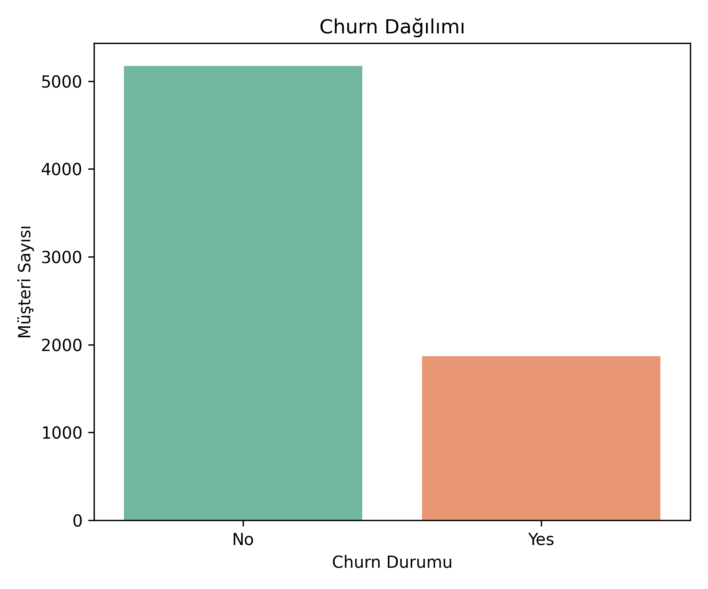
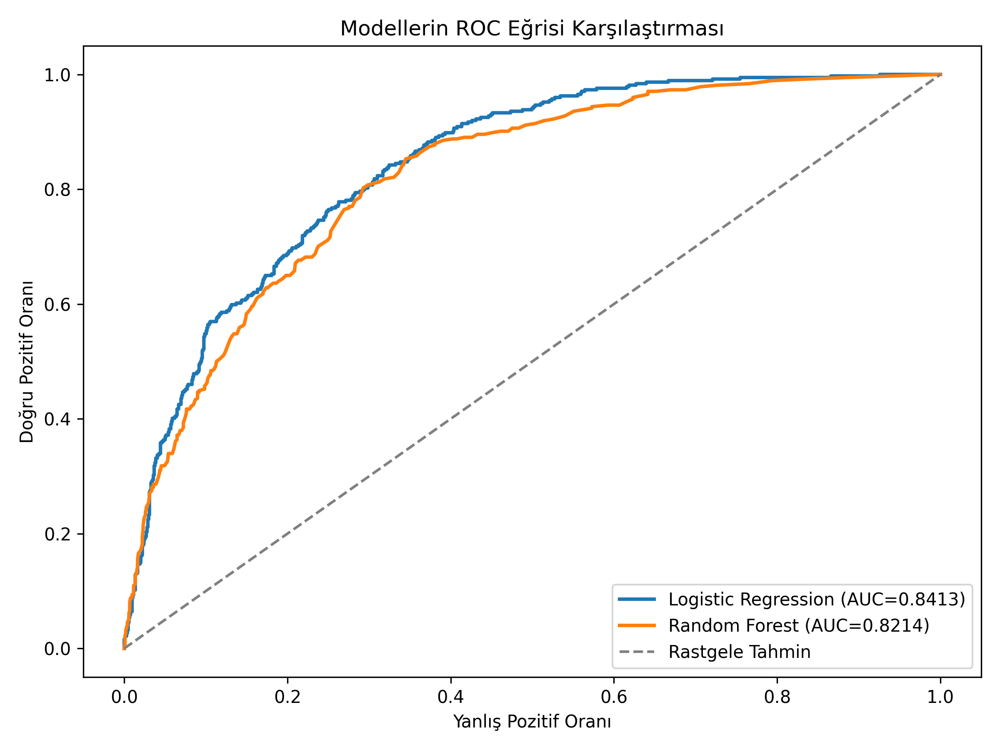
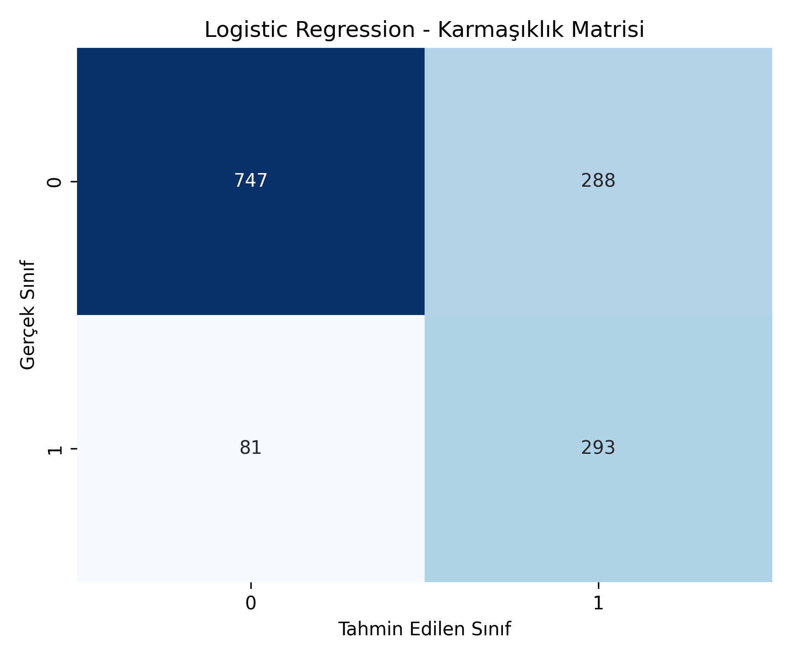
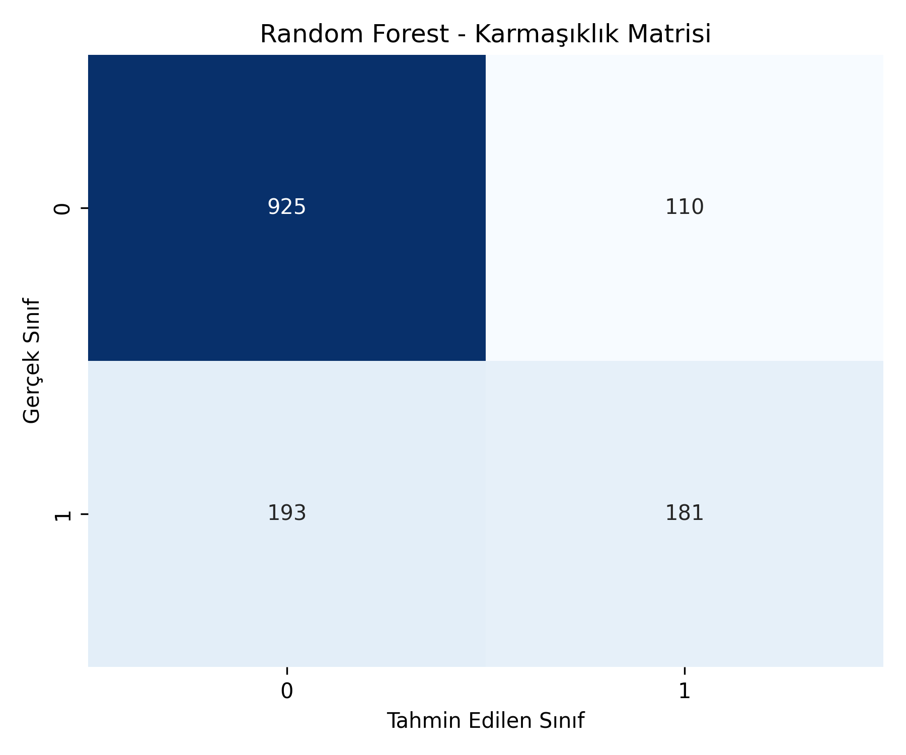
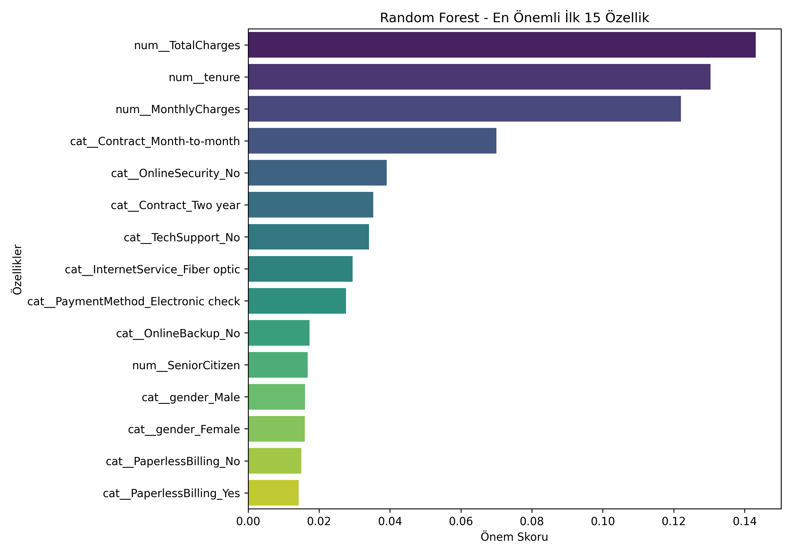

# Telco Customer Churn Analysis

This project performs an end-to-end machine learning analysis to predict customer churn based on the Telco Customer Churn dataset. It compares the performance of **Logistic Regression** and **Random Forest** models to identify which customers are more likely to leave the service.

## Dataset

The analysis uses the `WA_Fn-UseC_-Telco-Customer-Churn.csv` dataset. 
- **Total Records:** 7043
- **Total Features:** 21
- **Target Variable:** Churn
  - **Churn (Yes):** 1869
  - **Churn (No):** 5174

As the class distribution is imbalanced (majority are retained customers), relying solely on Accuracy is insufficient. Therefore, the evaluation also strongly considers **Recall, F1-Score, and ROC-AUC** metrics.

## Project Structure

```text
├── churn_analysis.py                   # Main analysis script
├── requirements.txt                    # Project dependencies
├── WA_Fn-UseC_-Telco-Customer-Churn.csv # Dataset
└── results/                            # Generated output and figures
    ├── churn_distribution.png
    ├── confusion_matrix_logistic_regression.png
    ├── confusion_matrix_random_forest.png
    ├── model_comparison.csv
    ├── random_forest_feature_importance.png
    └── roc_curve_comparison.png
```

## Requirements & Installation

1. Make sure you have Python 3 installed.
2. Clone this repository and navigate to the project folder.
3. Install the required dependencies using `pip`:

```bash
pip install -r requirements.txt
```

The primary dependencies are `pandas`, `numpy`, `matplotlib`, `seaborn`, and `scikit-learn`.

## How to Run

Execute the main script to run the full pipeline (data preprocessing, model training, evaluation, and visualization generation):

```bash
python churn_analysis.py
```

After running the script, the `results/` folder will be populated with evaluation metrics and visualizations.

---

## Results & Analysis

### Churn Distribution
Before modeling, the class distribution between retained ("No") and churned ("Yes") customers is visualized. The dataset is imbalanced, highlighting the need for robust evaluation metrics.



### Model Evaluation

Both Logistic Regression and Random Forest models were evaluated. The table below summarizes the performance metrics on the test set:

| Model | Accuracy | Precision | Recall | F1 Score | ROC-AUC |
|-------|----------|-----------|--------|----------|---------|
| Logistic Regression | 0.7381 | 0.5043 | 0.7834 | 0.6136 | 0.8413 |
| Random Forest | 0.7850 | 0.6220 | 0.4840 | 0.5444 | 0.8214 |

#### ROC Curve Comparison
The ROC curve demonstrates the trade-off between the true positive rate and false positive rate. Logistic Regression outperforms Random Forest in distinguishing between classes.



#### Confusion Matrices
The confusion matrices visualize the true vs. predicted classifications. Notice how Logistic Regression captures more true positives (actual churners) compared to Random Forest.

**Logistic Regression Confusion Matrix**


**Random Forest Confusion Matrix**


### Discussion

- **Logistic Regression** achieved a ROC-AUC of 0.8413. Looking at the confusion matrix, it correctly predicted 293 out of 374 actual churn customers (missing only 81). It provides a high **Recall (0.7834)**, making it much better at identifying the majority of churners.
- **Random Forest** achieved a higher Accuracy (0.7850) but a lower Recall (0.4840). It correctly predicted only 181 out of 374 actual churn customers (missing 193). While its overall accuracy is higher due to predicting the majority class ("No Churn") well, it falls short in detecting the actual risk of churn.

Since the primary business goal in the telecommunications sector is to identify as many potential churners as possible (so the company can offer campaigns or discounts), **Recall** is a critical metric. Consequently, **Logistic Regression** is considered the more suitable model for this specific problem.

### Feature Importance

The Random Forest model enables us to interpret which features have the strongest impact on customer churn. The most important variables identified are:
- **TotalCharges, tenure, and MonthlyCharges:** Financial behavior and the duration of stay are the biggest indicators of churn.
- **Contract Type:** Customers with short-term or month-to-month contracts have a higher tendency to churn.
- **Add-on Services:** Features like OnlineSecurity and TechSupport show that customers using extra services tend to be more loyal.



## Conclusion and Future Work

In this project, predicting customer churn was successfully conducted using Logistic Regression and Random Forest. Due to its superior ability to distinguish classes (higher ROC-AUC) and capture actual churners (higher Recall), Logistic Regression is the recommended model. With these insights, telecom companies can develop targeted retention strategies.

**Future Work:** 
- Implementing advanced ensemble learning algorithms such as XGBoost, LightGBM, and CatBoost.
- Applying hyperparameter optimization and cross-validation.
- Exploring different sampling methods (e.g., SMOTE) to handle class imbalance more effectively.

## References
- A. K. Ahmad, A. Jafar and K. Aljoumaa, “Customer Churn Prediction in Telecom Using Machine Learning in Big Data Platform,” Journal of Big Data, 2019.
- F. Pedregosa et al., “Scikit-learn: Machine Learning in Python,” JMLR, 2011.
- I. Witten, E. Frank and M. Hall, Data Mining: Practical Machine Learning Tools and Techniques, 2011.
- Kaggle, “Telco Customer Churn Dataset”
